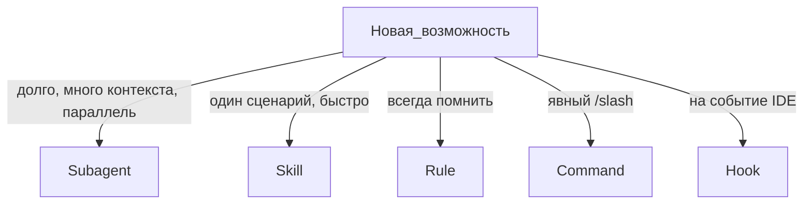

# Выбор правильного артефакта

## Таблица решений

| Критерий | Subagent | Skill | Rule | Command | Hook |
|----------|----------|-------|------|---------|------|
| Отдельное контекстное окно | Да | Нет | Нет | Нет | Нет |
| Параллельный запуск | Да | Нет | — | — | — |
| Автовызов Agent | По description | По description | alwaysApply / intelligent | Только вручную | По событию |
| Редактирует файлы | Если `readonly: false` | Через Agent | — | Делегирует Task | Скрипт |
| Масштаб 100+ | Реестр + категории | Папки skills/ | Много .mdc | commands/ | hooks.json |

## Типичные ошибки

| Ошибка | Правильно |
|--------|-----------|
| Mentor-наставник как skill | Subagent `readonly: true` |
| Maintainer KB как subagent без skill | Subagent + skill с `disable-model-invocation: true` |
| Роутинг 100 агентов в одном rule | Категории + `t-800-factory-routing` + registry |
| Changelog как subagent | Skill `generate-changelog` |

## Где лежат

| Артефакт | Проект | Плагин T-800 (install) | User-home (отдельный surface) |
|----------|--------|------------------------|-------------------------------|
| Subagent | `.cursor/agents/` | `plugins/local/t-800-agent/agents/` | `~/.cursor/agents/` (не зеркалится install) |
| Skill | `.cursor/skills/name/SKILL.md` | `plugins/local/.../skills/` | `~/.cursor/skills/` |
| Rule | `.cursor/rules/*.mdc` | `plugins/local/.../rules/` | `~/.cursor/rules/` (consent: mandatory-routing) |
| Command | `.cursor/commands/` | `plugins/local/.../commands/` | `~/.cursor/commands/` |
| Hook | `.cursor/hooks.json` | `plugins/local/.../hooks.json` | `~/.cursor/hooks.json` |

## Как устроен файл команды (commands/*.md)

Команда — это markdown-промпт в `commands/<name>.md` плагина (или `.cursor/commands/` проекта), вызывается слэшем `/<name>`. По docs плагинов commands — «agent-executable command files»: один из компонентов бандла наряду с rules, skills, agents, hooks и MCP.

Факты по репо T-800:

- **Без frontmatter** — все 18 файлов в `commands/` начинаются сразу с `# Заголовка`; обязательных полей нет
- Заголовок = имя вызова: `commands/t800-start.md` → `/t800-start`
- Типичная структура (обобщение по `t800-start.md`):
  1. **Роль/назначение** — одна строка, что команда делает и для какого surface
  2. **Законы и контракты** — ссылки на `shared/*-contract.md`, правила оркестрации
  3. **Нумерованные шаги** — последовательность отделов/стадий с явными `Task(agent)` и командами скриптов
  4. **Gates** — условия «готово»: auditor PASS, machine-скрипты exit 0
  5. **Handoff** — что отчитать пользователю и что запускать дальше
- Placeholders в угловых скобках (`<memory_path>`), таблицы режимов (DEEP/LIGHT/SKIP), строки прогресса — по вкусу команды
- От skill отличается тем, что это всегда явный ручной вызов целого сценария, а не авто-подхват по description

## Ссылки

- https://cursor.com/ru/docs/subagents
- https://cursor.com/docs/skills
- https://cursor.com/ru/docs/context/rules
- https://cursor.com/docs/hooks
- https://cursor.com/docs/plugins
