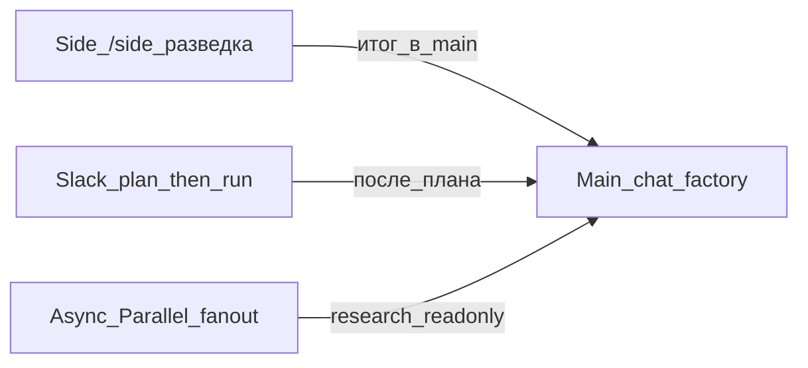

# Playbook 06 — Side chat, Slack и async / Parallel

**Для кого:** новичок, который путает main chat, `/side` и Slack  
**Результат:** знает, где разведка, где factory, как запускать async Task

## Схема



## Чеклист

- [ ] **Main chat** — `/t800-start` / `/t800-fix` / pipeline (не «болтать ради болтовни»)
- [ ] **Side chat** — команда `/side`: уточнения, Ask, чтение docs; **не** писать agents/skills
- [ ] **Slack** — agent: сначала план, потом старт (plan-before-start)
- [ ] **Async / Build in Parallel** — несколько Task для research fan-out; не параллелить конфликтные правки одних файлов
- [ ] Итог side/Slack вернуть в main, если нужна сборка

## Промпты (копировать)

**Side (`/side`):**
```
/side
Кратко: чем Side chat отличается от main для T-800?
Где делать разведку, где /t800-start?
```

**Slack (план перед стартом):**
```
В Slack: сначала план (файлы, риски), дождись «ок», потом run.
Не запускай factory без плана.
```

**Parallel / async:**
```
Запусти 2–3 readonly Task Build in Parallel для research fan-out.
Сборку артефактов оставь в main после синтеза.
```

## Проверка

- В ответе наставника есть `/side`, `Slack`, и `Parallel` или `async`
- Operator остаётся readonly (файлы не правит)
- Playbook: `playbooks/06-side-chat-i-async.md`

## Следующий шаг

Playbook 05 — factory workflow, или `/t800-start` в main

## KB

- `shared/operator-surface-2026-07-contract.md`
- `docs/НАЧАЛО-РАБОТЫ.md`
- `docs/ПОЛНАЯ-ИНСТРУКЦИЯ.md`
